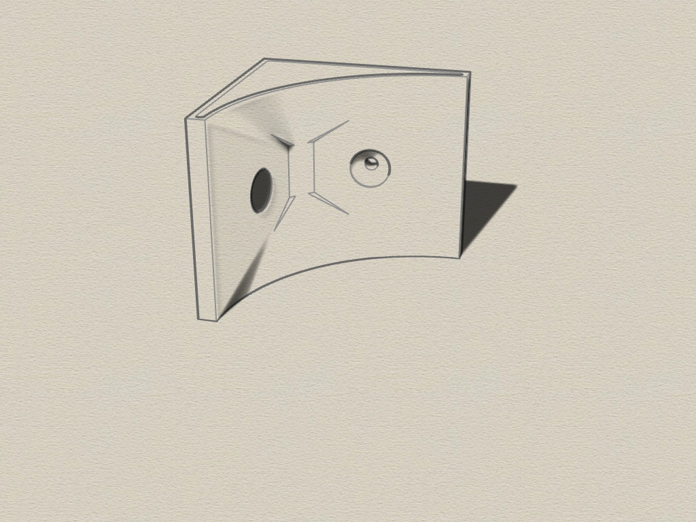

# Triangular-bracket
3D printable triangular brackets. Different forms. Created with Rhino 6.

#### 3D triangular-bracket
The wedges can be used to mount something on a wall or in the corner between wall and ceiling. 
This is very practical if you have little space in the basement.

Requirements:
* 3D printer 
* Filament of your choice

#### View
 
 

