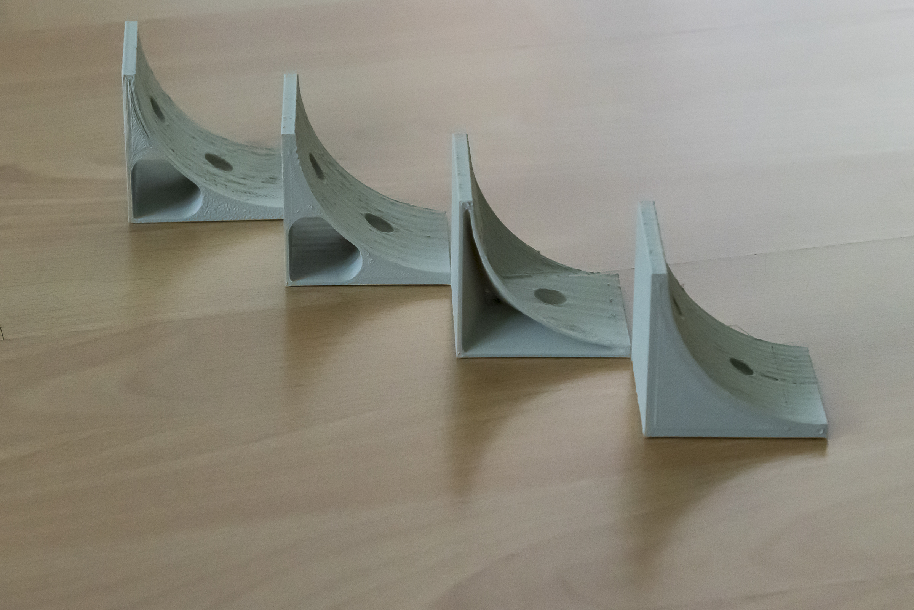

# Wedges
3D printable wedges, ceated with Rhino 6.

#### 3D wedges
The wedges can be used to mount something on a wall or in the corner between wall and ceiling. 
This is very practical if you have little space in the basement. There are different types of wedges.

Requirements:
* 3D printer 
* Filament of your choice

#### View
 
 

